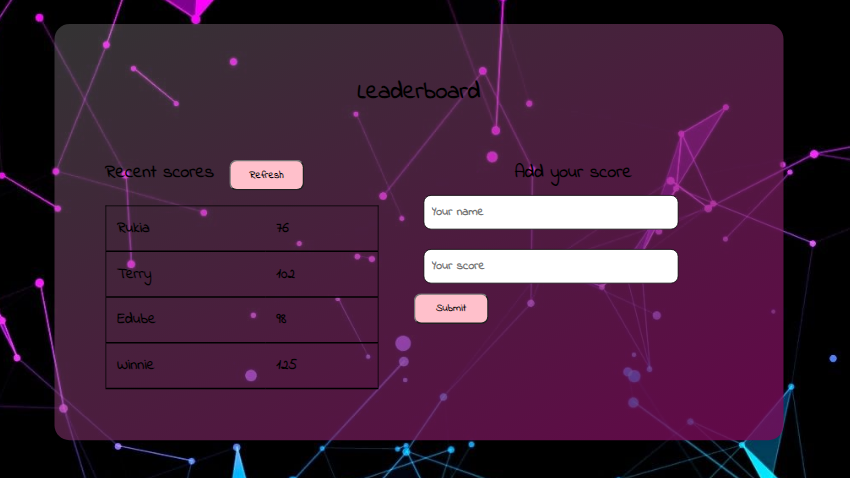

# Leaderboard

## Description
- The leaderboard website displays scores submitted by different players. It also allows you to submit your score. All data is preserved thanks to the external leaderboard API

## Built With

- HTML
- JAVASCRIPT
- LINTERS

## Live Demo
[coming soon](#)

> To view this project you need to do the following:

  ## Prerequisites
    - Github account
    - Code editor
    - Git

  ## Setup
   - git init
   - git clone https://github.com/edubew/Leaderboard.git

## Authors

👤 **Winfred Edube**

- GitHub: @edubew
- Twitter: @edube_winne
- LinkedIn: [LinkedIn](https://linkedin.com/in/winfred-edube-9820a422a/)

## 🤝 Contributing

Contributions, issues, and feature requests are welcome!

Feel free to check the [issues page](https://github.com/edubew/Awesome-books/issues).

## Show your support

Give a ⭐️ if you like this project!

## Acknowledgments

- Hat tip to anyone whose code was used

## 📝 License
This project is [MIT](https://github.com/edubew/mit/blob/main/LICENSE) licensed.

